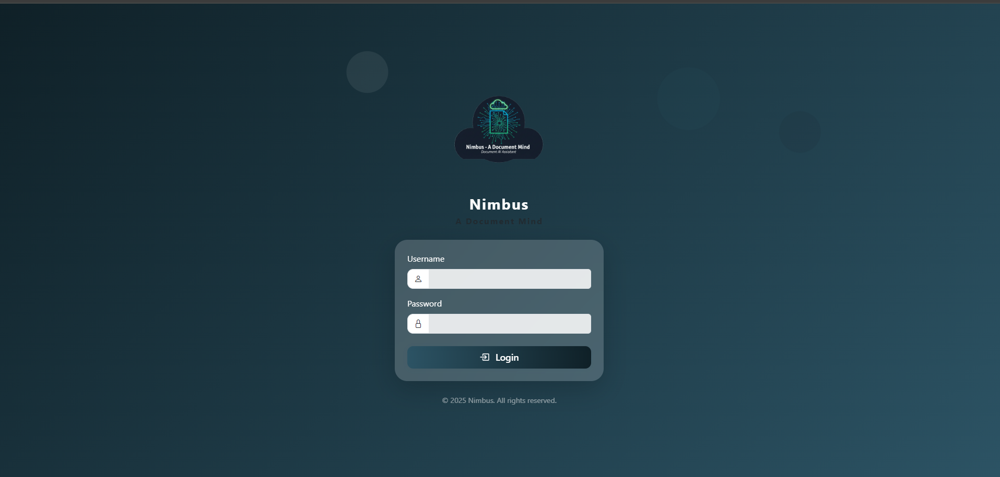
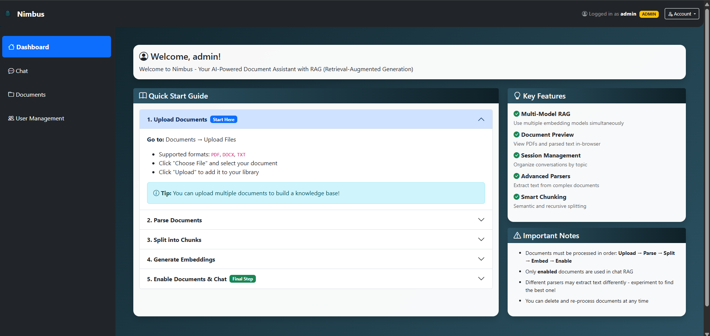
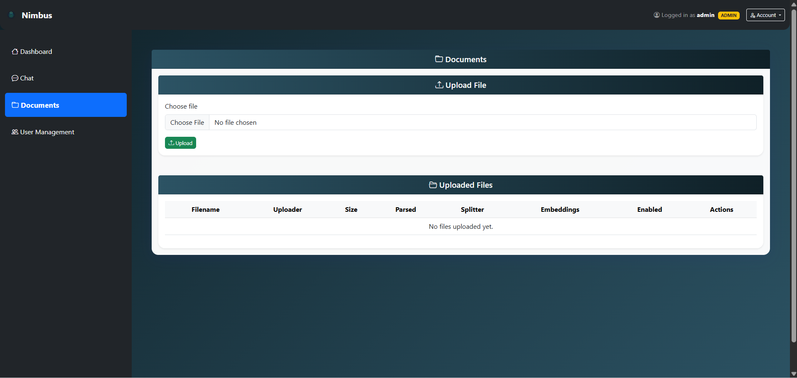
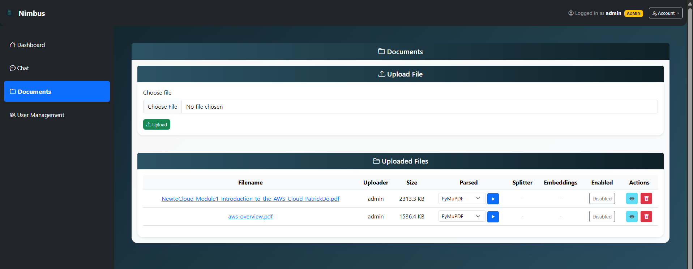
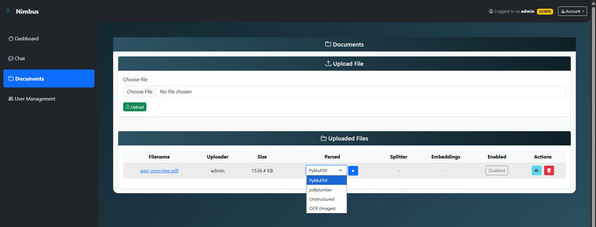
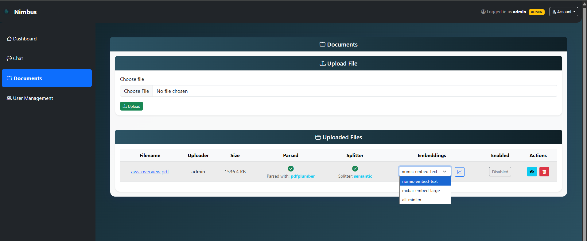
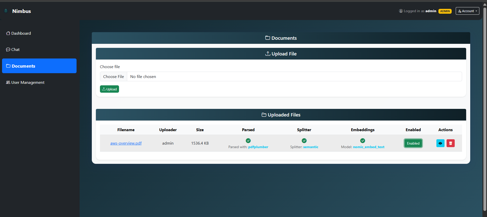
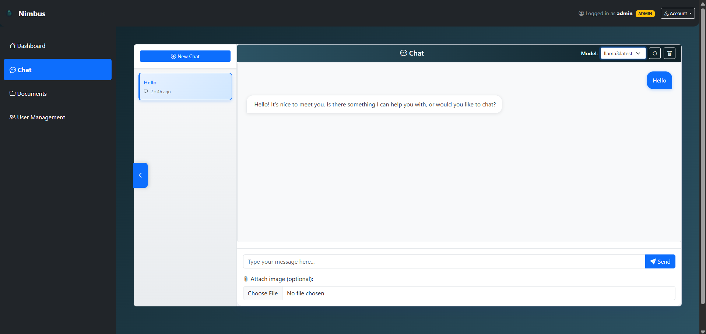

# Nimbus Usage Guide with Screenshots

This guide shows you how to use Nimbus with step-by-step screenshots and examples.

## Table of Contents
1. [Getting Started](#getting-started)
2. [Document Upload](#document-upload)
3. [Document Processing](#document-processing)
4. [Chat Interface](#chat-interface)

## Getting Started

### Login Screen

*The Nimbus login screen with the professional branding*

### Dashboard Overview

*Main dashboard showing navigation and overview of features*

## Document Upload

### Upload Interface

*Drag and drop interface for uploading documents*

### File Management

*View and manage your uploaded documents*

## Document Processing

### Parser Selection

*Choose the appropriate parser for your document type*

### Embedding Generation

*Generate embeddings with different models*

### Processing Status

*Monitor the progress of document processing*

## Chat Interface

### Chat Session

*Main chat interface for asking questions about your documents*

## Usage Examples

### Example 1: Processing a Research Paper
1. Upload your PDF research paper
2. Use **PDFPlumber** parser for tables and structured content
3. Apply **Semantic Splitting** for natural boundaries
4. Generate embeddings with **nomic-embed-text** and **mxbai-embed-large**
5. Ask questions like "What are the main findings?" or "Summarize the methodology"

### Example 2: Analyzing Scanned Documents
1. Upload scanned PDF or images
2. Use **OCR Parser** to extract text
3. Optionally use **OCR + Vision** for image descriptions
4. Apply **Recursive Splitting** for consistent chunks
5. Chat about the content naturally

### Example 3: Building a Knowledge Base
1. Upload multiple related documents
2. Process each with appropriate parsers
3. Enable all documents for RAG
4. Create different chat sessions for different topics
5. Ask cross-document questions to find connections

## Tips for Best Results

### Document Preparation
- Ensure PDFs have selectable text when possible
- Use high-resolution scans (300 DPI) for OCR
- Remove unnecessary pages to improve processing speed

### Parser Selection Guide
- **PyMuPDF**: Standard PDFs with good text extraction
- **PDFPlumber**: Documents with tables, forms, or complex layouts
- **Unstructured**: Advanced layout analysis and element detection
- **OCR**: Scanned documents, images, or poor-quality PDFs
- **OCR + Vision**: Documents with important visual elements

### Splitting Strategy
- **Recursive**: Good general-purpose option
- **Token-based**: When you know your LLM's token limits
- **Semantic**: Best for maintaining context and meaning

### Embedding Models
- Use multiple models for better retrieval coverage
- **nomic-embed-text**: Fast and efficient
- **mxbai-embed-large**: Higher accuracy, slower
- **all-minilm**: Good balance of speed and accuracy

## Troubleshooting

### Common Issues
1. **Document not processing**: Check file format and size limits
2. **Poor chat responses**: Ensure documents are enabled and have embeddings
3. **OCR not working**: Verify image quality and language settings
4. **Slow performance**: Consider using fewer embedding models or smaller chunks

### Performance Tips
- Process documents during off-peak hours
- Use smaller chunk sizes for faster embedding generation
- Disable documents you don't need for specific conversations
- Regularly clean up old chat sessions

---

*This guide will be updated with actual screenshots as they become available.*